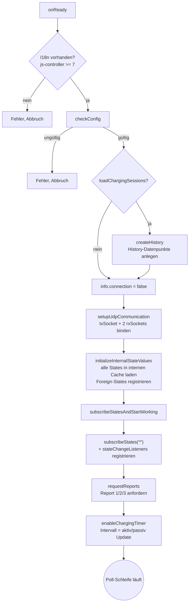
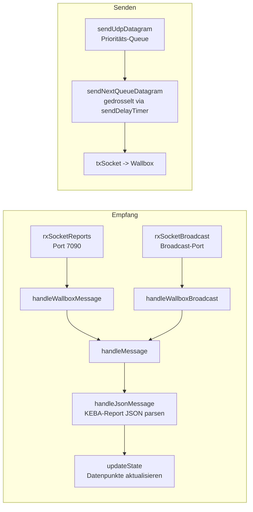
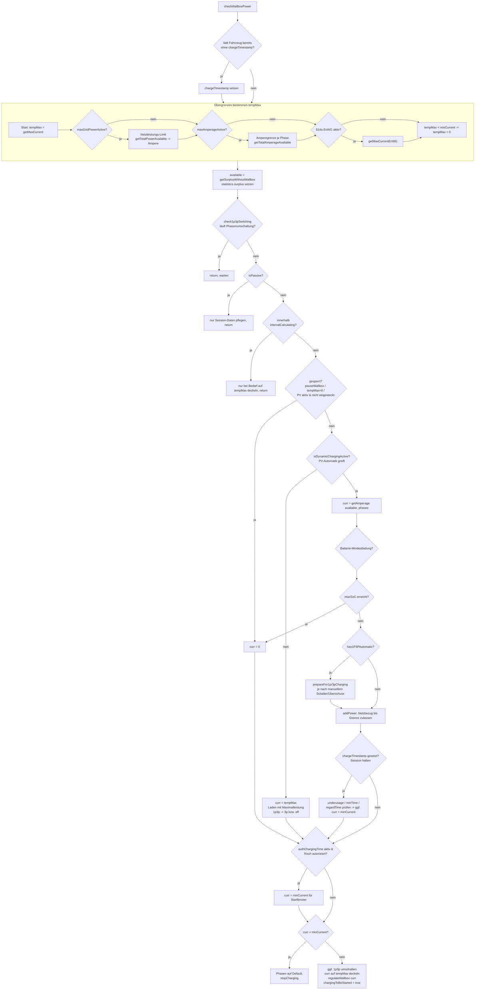

# Programmablauf – ioBroker.kecontact

Dieses Dokument beschreibt den Programmfluss des Adapters, das Zusammenspiel der
Konfigurations­optionen und der Datenpunkte. Die gesamte Logik liegt in `main.js`
in der Klasse `Kecontact`.

---

## 1. Übersicht

Der Adapter steuert eine KEBA KeContact P20/P30 (bzw. BMW i) Wallbox über **UDP**.
Kernaufgabe: den Ladestrom periodisch so regeln, dass das Fahrzeug bevorzugt aus
PV-Überschuss (optional aus Batteriespeicher) geladen wird und dabei Netz- und
Amperegrenzen eingehalten werden.

Zwei Betriebsarten:

- **Aktiv** (Standard): Adapter empfängt Broadcasts der Wallbox, rechnet und regelt.
- **Passiv** (`passiveMode` oder `subsequent wallbox`): nur Beobachtung, keine
  Regelung. Nötig, weil pro Wallbox nur **eine** Instanz den Broadcast-Port
  belegen darf.

---

## 2. Lebenszyklus / Start

Wichtige Punkte:

- `checkConfig()` verwirft ungültige IPs (`0.0.0.0`, `127.0.0.1`), setzt
  `isPassive` und die Update-Intervalle.
- Der interne State-Cache (`getStateInternal`/`setStateInternal`) spiegelt alle
  ioBroker-States, damit die Regelung ohne asynchrone Reads rechnen kann.
- `stateVehicleSoC` kann auf einen **Fremd-State** zeigen; dieser wird beim Start
  und bei Änderung dynamisch (un)subscribed.

---

## 3. UDP-Kommunikation

- **Senden ist gedrosselt** (Queue + `sendDelayTimer`), weil die Wallbox schnelle
  Kommandos verwirft. `highPriority` stellt ein Kommando vorne in die Queue.
- Schreiben auf steuernde Datenpunkte löst über `stateChangeListeners` das passende
  UDP-Kommando aus (siehe Tabelle Abschnitt 6).
- Bei mehreren Instanzen tauschen sich diese über `internal.message`
  (`handleWallboxExchange`) aus.

---

## 4. Regel-Schleife: `checkWallboxPower()`

Das Herz des Adapters. Wird periodisch (Timer) und bei erzwungenen Neuberechnungen
(`forceUpdateOfCalculation`) aufgerufen. Ergebnis ist ein Ladestrom `curr` in mA,
der via `regulateWallbox()` gesetzt wird – oder `stopCharging()`.

### Kern-Reihenfolge (Priorität der Einschränkungen)

1. **Harte Obergrenzen** zuerst: `maxGridPower` → `maxAmperage` → `§14a EnWG`.
   Diese können den Strom nur **senken**, nie erhöhen.
2. **Sperren**: manuelle Pause, kein Fahrzeug eingesteckt, `tempMax = 0`.
3. **Betriebsmodus**: dynamisch (PV) vs. Maximalleistung
   (`isDynamicChargingActive` – abhängig von PV-Automatik, `targetSoC`, `maxSoC`).
4. **Überschussrechnung** mit optionaler Batterie-Einbeziehung.
5. **Session-Halten**: `addPower`, `underusage`, `minTime`, `regardTime` verhindern
   ständiges Ein/Aus – ein einmal gestarteter Ladevorgang wird toleriert
   fortgeführt.
6. **Phasenumschaltung 1p/3p** als Sonderfall, der die Rechnung neu anstößt.

---

## 5. Zusammenspiel der Optionen (Konfiguration → Verhalten)

Optionen aus `admin/jsonConfig.json` (`this.config.*`). Fremd-States sind Verweise
auf Datenpunkte **anderer** Adapter (Energiezähler, Speicher, Fahrzeug-SoC).

| Bereich | Option(en) | Wirkung im Ablauf |
|---|---|---|
| Verbindung | `host`, `pollInterval`, `passiveMode`, `loadChargingSessions`, `lessInfoLogs` | Basis: IP, Poll-Takt, aktiv/passiv, Session-Download, Log-Detail |
| PV-Basis | `stateSurplus`, `stateRegard` | Fremd-States für Überschuss / Netzbezug → `getSurplusWithoutWallbox` |
| PV-Feintuning | `minAmperage`, `addPower`, `delta`, `underusage`, `minTime`, `regardTime` | Start-/Halte-Verhalten der Session, Hysterese gegen Flattern |
| Wallbox-Einbezug | `statesIncludeWallbox`, `wallboxNotIncluded` | ob Wallbox-Leistung in Zählerwerten bereits enthalten ist |
| 1p/3p | `state1p3pSwitch`, `1p3pSwitchIsNO`, `1p3pViaX2`, `useX1forAutomatic` | Phasenumschaltung via Schütz (NO/NC) oder X2-Port; X1-Eingang |
| Batteriespeicher | `stateBatteryCharging`, `stateBatteryDischarging`, `stateBatterySoC`, `batteryPower`, `batteryChargePower`, `batteryMinSoC`, `batteryLimitSoC`, `batteryStorageStrategy` | ob/wie Speicher fürs Fahrzeug genutzt wird → `getBatteryStoragePower`, Strategie 1–4 |
| §14a EnWG | `stateEnWG`, `dynamicEnWG`, `powerEnWG` | fixe 6 A oder dynamische Begrenzung → `getMaxCurrentEnWG` |
| Leistungslimit | `maxPower`, `stateEnergyMeter1..3`, `wallboxNotIncluded` | Gesamt­leistungs-Deckel → `getTotalPowerAvailable` |
| Amperelimit | `maxAmperage`, `stateAmperagePhase1..3`, `amperageUnit` | Deckel je Phase → `getTotalAmperageAvailable` |
| Autorisierung | `authChargingTime` | Zwangs-Ladefenster nach RFID-Autorisierung |

Merksatz: **Fremd-States liefern Messwerte**, **Optionen liefern Parameter/Grenzen**,
und die dynamischen `automatic.*`-Datenpunkte erlauben Übersteuerung zur Laufzeit.

---

## 6. Steuernde Datenpunkte (Schreiben → UDP-Kommando)

Registriert in `subscribeStatesAndStartWorking()`. Schreiben löst sofort ein
UDP-Kommando aus:

| Datenpunkt | Kommando an Wallbox |
|---|---|
| `enableUser` | `ena 0/1` |
| `currentUser` | `curr <mA>` |
| `currentTimer` (+`timeoutCurrentTimer`) | `currtime <mA> <t>` |
| `output` | `output 0/1` |
| `display` | `display 0 0 0 0 <text>` |
| `setenergy` | `setenergy <Wh*10>` |
| `report` | `report <n>` |
| `start` / `stop` | `start <tag>` / `stop <tag>` |
| `setdatetime` | `setdatetime <...>` |
| `unlock` | `unlock` |
| `x2phaseSource` / `x2phaseSwitch` | `x2src <n>` / `x2 <n>` (+ `1p3pSwTimestamp`) |

---

## 7. Dynamische Steuer-Datenpunkte `automatic.*`

Diese verändern das Regelverhalten zur Laufzeit (per Skript/Vis beschreibbar),
ohne UDP-Kommando – sie fließen in `checkWallboxPower` ein:

| Datenpunkt | Bedeutung |
|---|---|
| `automatic.photovoltaics` | PV-Automatik an (dynamisch) / aus (Maximalleistung) |
| `automatic.pauseWallbox` | sofortiger Ladestopp, solange `true` |
| `automatic.addPower` | erlaubter zusätzlicher Netzbezug (W); negativ = Reserve |
| `automatic.limitCurrent` / `automatic.limitCurrent1p` | Ampere-Deckel dynamisches Laden (0 = aus / aus Settings) |
| `automatic.maxGridPower` | Netzleistungs-Deckel (0 = aus Settings, `maxPower`) |
| `automatic.calcPhases` | Phasenzahl für Berechnung (KeContact Deutschland-Edition) |
| `automatic.1p3pCharging` | erzwungen 1p oder 3p |
| `automatic.batteryStorageStrategy` | Speicher-Strategie 1–4 |
| `automatic.batterySoCForCharging` | Speicher erst ab diesem SoC nutzen |
| `automatic.stateVehicleSoC` | Fremd-State mit Fahrzeug-SoC |
| `automatic.targetSoC` | bis zu diesem SoC ohne PV mit Maximalleistung laden |
| `automatic.maxSoC` | oberhalb dieses SoC nicht mehr laden |
| `automatic.resetTargetSoC` | `targetSoC` nach Erreichen zurücksetzen |

---

## 8. Ergebnis-/Status-Datenpunkte

| Datenpunkt | Inhalt (gesetzt durch Regelung) |
|---|---|
| `statistics.surplus` | aktueller Überschuss für PV-Automatik |
| `statistics.maxPower` / `statistics.maxAmperage` | wirksame Leistungs-/Amperegrenze |
| `statistics.chargingPhases` | aktuelle Phasenzahl |
| `statistics.plugTimestamp` / `chargeTimestamp` / `authPlugTimestamp` | Zeitstempel Einstecken / Ladebeginn / Autorisierung |
| `statistics.consumptionTimestamp` / `1p3pSwTimestamp` | Halte-Timer Netzbezug / letzte Phasenumschaltung |
| `statistics.lastChargeStart` / `lastChargeFinish` / `lastChargeAmount` | letzte Ladesession |
| `statistics.sessionId`, `rfid_tag`, `rfid_class` | Session-/RFID-Infos |
| `info.connection` | Wallbox erreichbar |

Roh-Messwerte der Wallbox (aus KEBA-Reports): `state`, `plug`, `p`, `u1..u3`,
`i1..i3`, `ePres`, `eTotal`, `maxCurrent`, `currentHardware` usw.

---

## 9. Kurz-Zusammenfassung des Zusammenspiels

1. **Messwerte** kommen per UDP-Report (eigene Wallbox) und aus **Fremd-States**
   (Zähler, Speicher, Fahrzeug-SoC) in den internen Cache.
2. **Optionen** legen Parameter und harte Grenzen fest; **`automatic.*`** erlaubt
   Laufzeit-Übersteuerung.
3. `checkWallboxPower()` verrechnet beides zu einem Ladestrom, unter Beachtung der
   Reihenfolge Grenzen → Sperren → Modus → Überschuss → Session-Halten → 1p/3p.
4. Das Ergebnis wird via `regulateWallbox()`/`stopCharging()` als UDP-Kommando
   gesendet und in `statistics.*` gespiegelt.
